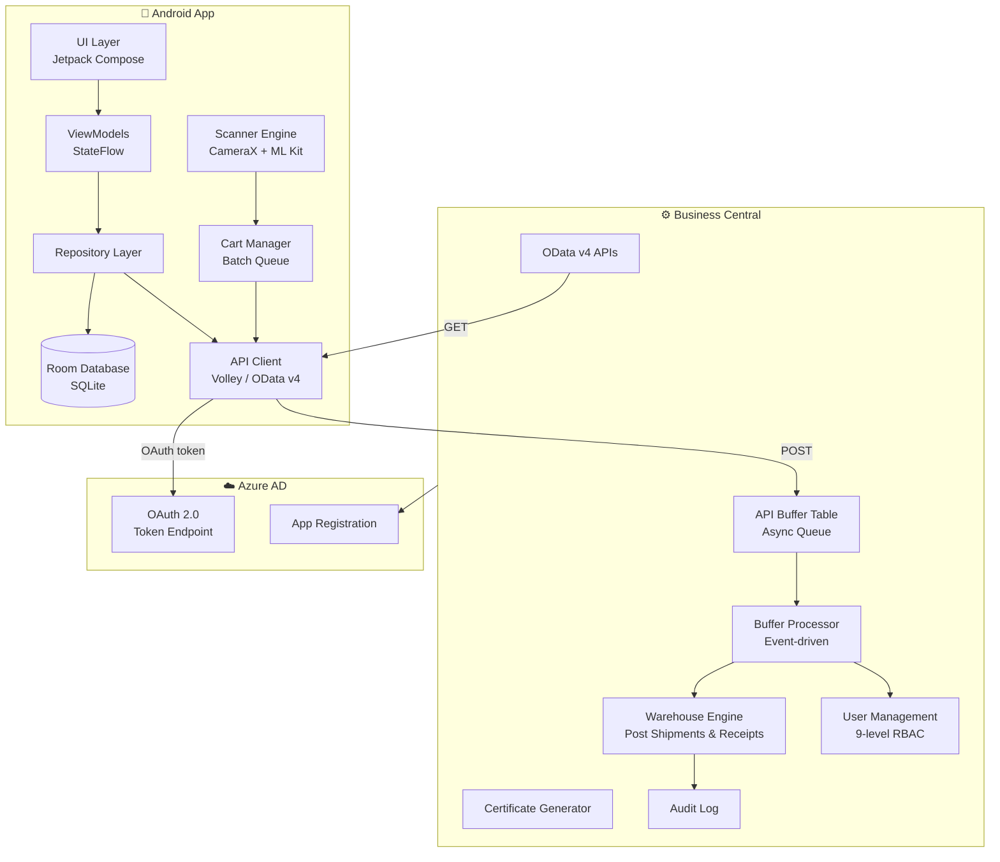
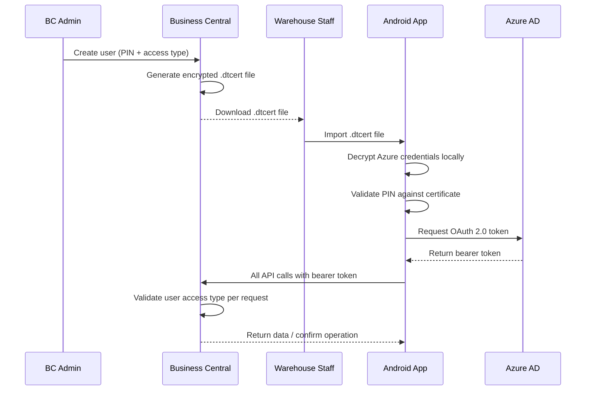
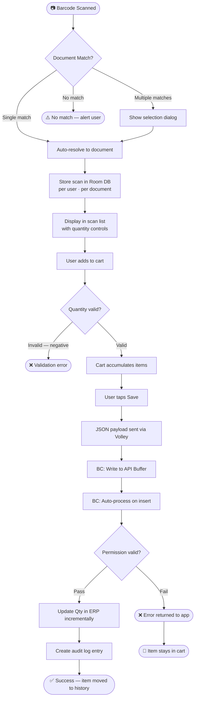

> 📌 **Portfolio Showcase** — This repository contains architecture documentation, system design, and business outcomes. Source code is proprietary and not included.

---

# 📦 Warehouse Management System — Mobile + ERP Integration

**End-to-end Android application integrated with Microsoft Dynamics 365 Business Central for real-time warehouse operations management.**

---

## Table of Contents

- [Overview](#overview)
- [Key Features](#key-features)
- [Technical Architecture](#technical-architecture)
- [Architecture Diagrams](#architecture-diagrams)
- [What I Built](#what-i-built)
- [Results & Impact](#results--impact)
- [Skills Demonstrated](#skills-demonstrated)
- [Repository Structure](#repository-structure)
- [Detailed Documentation](#detailed-documentation)
- [Getting Started](#getting-started)
- [Live Demo](#live-demo)
- [FAQ](#faq)

---

## Overview

This is a production-grade, full-stack warehouse management solution built from the ground up. A native Android application pairs with custom Microsoft Dynamics 365 Business Central extensions to give warehouse staff a fast, reliable, and offline-capable mobile interface for managing shipments, receipts, and inventory directly from the warehouse floor.

The system replaces manual, desktop-bound workflows with barcode-driven mobile operations — reducing document processing time by ~60% and eliminating nearly all manual data entry errors. It is deployed in a live warehouse environment and handles daily operations across multiple document types and user roles.

---

## Key Features

### 📱 Warehouse Operations
- Real-time management of warehouse shipments and receipts
- Direct posting of warehouse documents to the ERP from mobile
- Document release and reopen functionality without desktop access
- Unified dashboard displaying all active warehouse documents per user role

### 🔍 Scanning & Data Entry
- Barcode and QR code scanning with instant item verification against live ERP data
- Global scanner accessible from the home screen for cross-document scanning
- Automatic single-match resolution; manual selection dialog on multiple document hits
- Visual scan confirmation with per-item quantity adjustment before committing

### 🛒 Batch Processing
- Shopping cart–style interface for accumulating multiple quantity adjustments
- Bulk submission of all pending updates to the ERP in a single operation
- Incremental update logic — each adjustment adds to the existing ERP value, never overwrites
- Per-user adjustment history for audit trail and progress tracking

### 🔐 Security & Access Control
- Certificate-based authentication using a custom `.dtcert` file provisioned per user
- Secure credential delivery — no plain-text passwords stored or transmitted
- Role-based access control with 9 distinct permission levels covering quantity editing, document posting, and full admin
- Server-side permission validation on every inbound operation

---

## Technical Architecture

| Category | Technology | Purpose |
|----------|------------|---------|
| **Language** | Kotlin 2.0 | Android application development |
| **UI Framework** | Jetpack Compose + Material 3 | Declarative, reactive UI layer |
| **Local Database** | Room (SQLite) | Offline-first data persistence |
| **Camera & Scanning** | CameraX + ML Kit | Barcode and QR code scanning |
| **Networking** | Volley | HTTP communication with ERP APIs |
| **State Management** | StateFlow | Reactive UI state across screens |
| **ERP Platform** | Microsoft Dynamics 365 Business Central | Core warehouse and inventory management |
| **Backend Language** | AL (Application Language) | Business Central extension development |
| **API Protocol** | OData v4 REST | Mobile-to-ERP data exchange |
| **Authentication** | OAuth 2.0 + Certificate-based auth | Secure API access and user identity |
| **Architecture Pattern** | MVVM + Repository | Separation of concerns and testability |
| **Async Processing** | Event-driven buffer table | Decoupled write operations |

---

## Architecture Diagrams

### System Architecture



### Certificate Authentication Flow



### Scan-to-ERP Data Flow



---

## What I Built

I was the **sole developer** on this project, responsible for every layer from requirements gathering through production deployment.

**Android Application (Frontend)**
Built the complete Android application from scratch using Kotlin and Jetpack Compose. Architected a singleton manager system for `CartManager`, `GlobalScanManager`, and `ScanSessionManager` — each persisting state to Room Database so that scan sessions, pending adjustments, and sent history survive app restarts, screen rotations, and user logouts. The `GlobalBarcodeRepository` caches all item reference data in memory for instant barcode matching without network calls during scanning.

**Business Central Extensions (Backend)**
Developed AL extensions that augment the standard Business Central warehouse module with new OData v4 API endpoints, an asynchronous buffer-based request processing engine, a certificate generation utility, a user management table with PIN and access-type support, and a comprehensive audit log. All backend logic integrates cleanly with existing BC warehouse codeunits and follows AL extension best practices.

**API Design & Integration**
Designed the full API contract: OData endpoints for GET operations (shipments, receipts, item references) and a buffer-table pattern for all write operations. This architecture decouples mobile writes from synchronous ERP processing, provides resilience against network interruptions, and enables incremental quantity updates rather than destructive overwrites.

**Security Architecture**
Designed and implemented a certificate-based authentication system. Administrators provision users in Business Central, and the system generates a `.dtcert` file containing encrypted Azure AD credentials and user metadata. The mobile app imports this file, decrypts credentials locally, and uses them to obtain OAuth 2.0 tokens from Azure AD for all subsequent API calls — no passwords are ever stored or transmitted in plain text.

---

## Results & Impact

| Metric | Before | After | Improvement |
|--------|--------|-------|-------------|
| Warehouse processing time (per document) | 8–10 minutes | 3–4 minutes | **~60% faster** |
| Data entry errors (weekly avg) | 15–20 errors | 0–1 errors | **~95% reduction** |
| Inventory visibility delay | 24 hours | Real-time | **Instant** |
| Training time for new staff | 2 days | 2 hours | **75% faster** |

- ✅ Warehouse staff update ERP records directly from the floor — no desktop required
- ✅ Zero data loss guaranteed through offline queuing and session persistence across app restarts
- ✅ Batch operations reduced the number of individual API calls by over 80% compared to a naive one-item-at-a-time approach
- ✅ Role-based access eliminated over-permissioning and reduced admin overhead for access management

📊 See [Business Impact](docs/IMPACT.md) for the full metrics breakdown, ROI calculation, and client testimonials.

---

## Skills Demonstrated

**Android Development**
`Kotlin` `Jetpack Compose` `Material 3` `Room Database` `CameraX` `ML Kit` `Volley` `StateFlow` `MVVM` `Repository Pattern` `Offline-first Architecture`

**ERP & Backend**
`Microsoft Dynamics 365 Business Central` `AL Language` `OData v4` `REST API Design` `Event-driven Architecture` `Async Buffer Processing`

**Security**
`Certificate-based Authentication` `RSA Encryption` `OAuth 2.0` `Azure Active Directory` `Role-based Access Control`

**Architecture & Patterns**
`Offline-first Design` `Singleton State Management` `Repository Pattern` `Incremental Update Logic` `Async Request Queuing`

**Database**
`SQLite` `Room ORM` `Multi-entity local schema` `Per-user data isolation`

---

## Repository Structure

```
dynasol-365-wms-portfolio/
├── README.md                   # This file — complete project overview
├── diagrams/                   # Architecture diagrams (PNG + Mermaid source)
│   ├── system-architecture.png
│   ├── auth-flow.png
│   └── data-flow.png
└── docs/                       # Detailed documentation
    ├── ARCHITECTURE.md         # Technical deep dive (code-free)
    ├── LESSONS_LEARNED.md      # Challenges and solutions
    └── IMPACT.md               # Business outcomes and metrics
```

> ⚠️ **No source code in this repository** — this is a portfolio/documentation showcase.

---

## 📚 Detailed Documentation

This README provides a comprehensive overview. For deeper dives into specific aspects:

| Document | Description |
|----------|-------------|
| [Architecture Deep Dive](docs/ARCHITECTURE.md) | Complete system architecture, component details, technology decisions, and data flow explanations (code-free) |
| [Lessons Learned](docs/LESSONS_LEARNED.md) | Technical challenges encountered during development and how they were solved — scanner flicker, offline persistence, permission design, batch performance |
| [Business Impact](docs/IMPACT.md) | Quantifiable results, ROI calculations, user adoption metrics, and client testimonials |

👉 *All documentation is code-free and portfolio-safe — architecture patterns and business outcomes only.*

---

## Getting Started

This repository contains documentation only. To explore the project:

1. **Browse this README** for the full system overview, architecture diagrams, and technology stack
2. **Read the docs** — start with [Architecture Deep Dive](docs/ARCHITECTURE.md) for technical depth
3. **Review the impact** — [Business Impact](docs/IMPACT.md) covers measurable outcomes
4. **Request a demo** — see the Live Demo section below

For businesses interested in a similar solution, the system requires a Microsoft Dynamics 365 Business Central environment and Android devices running Android 7.0 (API 24) or higher.

---

## Live Demo

A live demo is available upon request. This includes:

- Walkthrough of the Android application (video or screen share)
- Review of the Business Central extension interface
- Discussion of the architecture decisions and trade-offs
- Exploration of specific features relevant to your use case

To request a demo, reach out via [GitHub](https://github.com/Hafsaailyas).

---

## FAQ

**Q: Why is the source code not included?**
The source code is proprietary and belongs to the client. This repository showcases architecture, design decisions, and business outcomes — the aspects that demonstrate my capabilities as a developer.

**Q: Can this system be built for my warehouse operations?**
Yes. The architecture is designed around standard Business Central warehouse module patterns and can be adapted for any organisation running Dynamics 365 BC. The permission system, scanning engine, and offline architecture are all configurable. Get in touch to discuss your requirements.

**Q: What Business Central version is required?**
The extensions were developed for Business Central v24 (cloud) with OData v4 API support. They are compatible with BC v20 and above, and both cloud and on-premises deployments with appropriate Azure AD configuration.

**Q: How long does implementation take?**
For a greenfield implementation on an existing Business Central environment, the full system (BC extensions + Android app + user provisioning) can be deployed in 6–10 weeks depending on the complexity of warehouse document workflows and number of user roles required.

---

*Built with Kotlin, Jetpack Compose, and Microsoft Dynamics 365 Business Central*

🔗 [GitHub Profile](https://github.com/Hafsaailyas)
