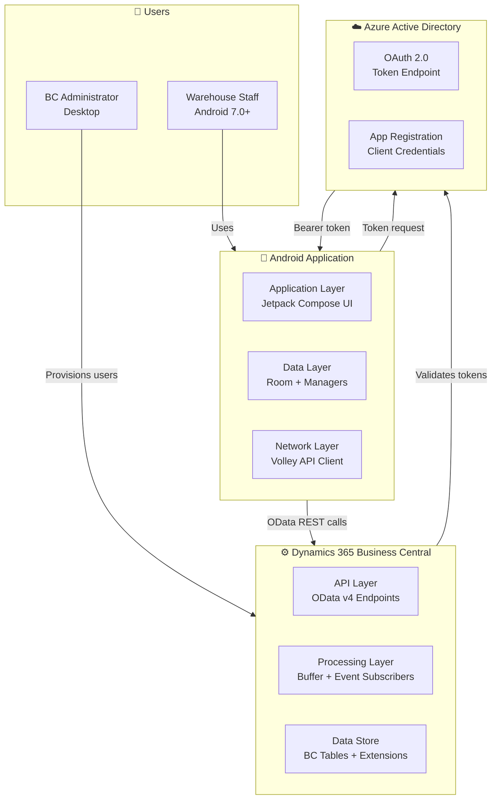
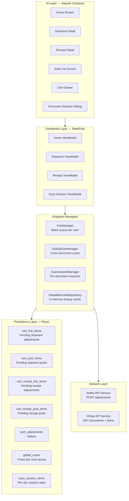
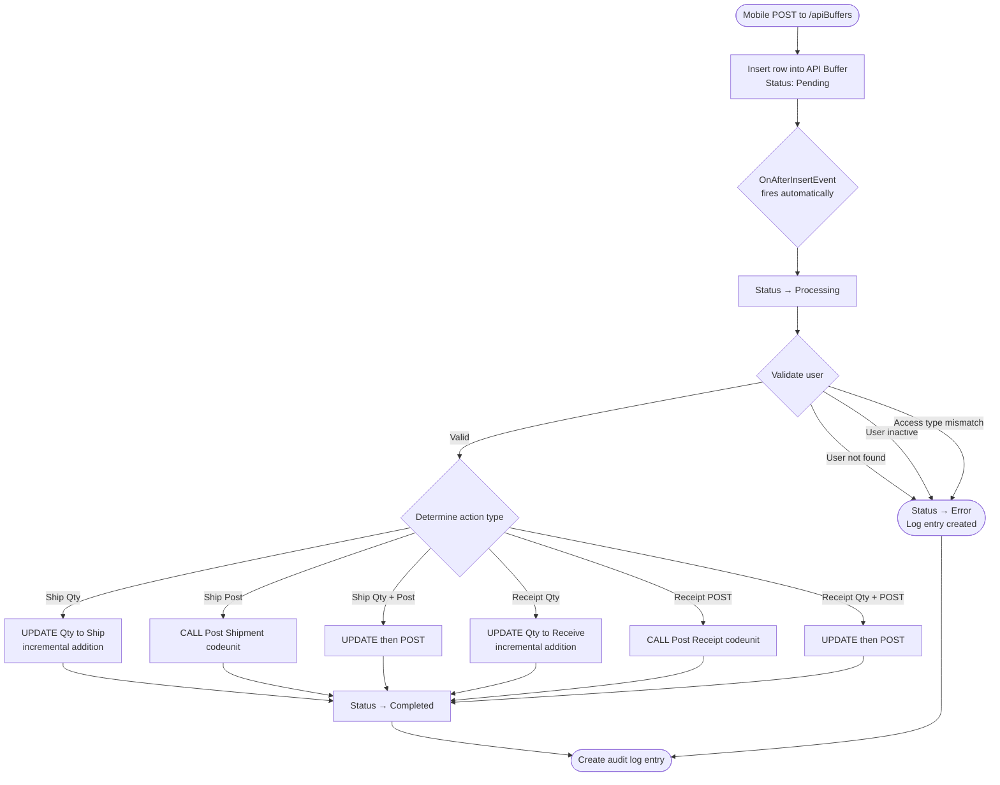

[← Back to README](../README.md)

# Architecture Deep Dive

> 📌 **Portfolio Document** — Technical architecture reference. No source code included.

---

## Table of Contents

- [Overview](#overview)
- [System Context](#system-context)
- [Frontend Architecture](#frontend-architecture)
- [Backend Architecture](#backend-architecture)
- [Database Design](#database-design)
- [Security Architecture](#security-architecture)
- [Key Design Decisions](#key-design-decisions)

---

## Overview

The Warehouse Management System is a full-stack solution spanning two platforms: a native Android mobile application and a set of Microsoft Dynamics 365 Business Central extensions. The two systems communicate exclusively through OData v4 REST APIs, with all write operations routed through an asynchronous buffer layer on the Business Central side to decouple mobile clients from synchronous ERP processing.

The architectural philosophy is **offline-first on the client, event-driven on the server**. The Android app treats the local Room database as the source of truth for all user-facing state, syncing to Business Central only when the user explicitly initiates a save. Business Central processes incoming requests through an event-subscriber pattern that triggers automatically on buffer table inserts.

---

## System Context

---

## Frontend Architecture

### Component Architecture

### Singleton Manager Responsibilities

**CartManager** — the central state manager for all pending quantity adjustments. It maintains separate queues for shipment and receipt adjustments, enforces the rule that final quantities cannot be negative, and exposes both single-item and bulk-save operations. All state is persisted to Room, so the cart survives app restarts and user logouts. Cart items are keyed per user so multiple operators can share a device without data bleed.

**GlobalScanManager** — handles cross-document barcode scanning initiated from the Home screen. Scans accumulate in a per-user queue until the user taps "Done", at which point they are committed to the target document. This manager coordinates with `GlobalBarcodeRepository` for document matching and presents a selection dialog when a barcode maps to multiple documents.

**ScanSessionManager** — handles in-document scanning on the Shipment Detail and Receipt Detail screens. Sessions are scoped per document per user and persist across app kills, so a warehouse operator can put their phone down mid-document and resume exactly where they left off.

**GlobalBarcodeRepository** — a singleton that caches all item reference data from Business Central in memory at login time. It maintains type-filtered lookup maps (shipment documents vs receipt documents) for O(1) barcode resolution. The cache is refreshed on login and cleared on logout.

---

## Backend Architecture

### Business Central Object Overview

The BC extensions occupy a reserved object range and consist of four custom tables, two table extensions, three API pages, two codeunits, and event subscriber bindings.

**Custom Tables**

- **DTE DWM Setup** — stores administrator-level configuration including Azure AD credentials (encrypted), license key, and system settings.
- **DTE DWM WHS Users** — the warehouse user master table. Stores UserCode, FullName, PIN (hashed), AccessType (enum of 9 values), certificate data, and Active flag.
- **DTE DWM API Buffer** — the central request queue. Each row represents a mobile request with a Status field (Pending → Processing → Completed/Error), the action type, JSON payload, and processing timestamps.
- **DTE DWM WHS User Log** — full audit trail. Every buffer entry, regardless of outcome, creates a log record with user, action, document reference, quantity delta, timestamp, and status.

**Table Extensions**

Two extensions on standard BC warehouse tables enforce zero-initialisation: new Warehouse Shipment Lines have `Qty. to Ship` set to 0 on insert, and new Warehouse Receipt Lines have `Qty. to Receive` set to 0. This ensures the mobile app's incremental update model is always correct — the mobile sends a delta, BC adds it to a known-zero baseline.

### Buffer Processing Pattern

---

## Database Design

### Android Room Database

The local Room database uses seven entities, each serving a distinct purpose in the offline-first architecture. All entities are keyed per user to support shared-device scenarios.

| Entity | Purpose |
|--------|---------|
| `cart_line_items` | Pending shipment quantity adjustments not yet sent to BC |
| `cart_post_items` | Shipment documents queued for bulk posting |
| `cart_receipt_line_items` | Pending receipt quantity adjustments not yet sent to BC |
| `cart_receipt_post_items` | Receipt documents queued for bulk posting |
| `sent_adjustments` | Historical record of successfully sent adjustments |
| `global_scans` | Cross-document scan queue (pre-commit, GlobalScanManager) |
| `scan_session_items` | Per-document, per-user scan session state |

All entities include a `userId` field for per-user isolation and a `timestamp` for ordering and debugging.

### Business Central Tables

| Table | Type | Key Fields |
|-------|------|-----------|
| DTE DWM Setup | Configuration | Single-record setup table |
| DTE DWM WHS Users | Master | UserCode, AccessType, Active |
| DTE DWM API Buffer | Transaction | Status, ActionType, Payload, ProcessedAt |
| DTE DWM WHS User Log | Audit | UserCode, Action, DocumentNo, Qty, Status, Timestamp |

---

## Security Architecture

### Authentication Flow

The system uses a two-layer security model: certificate-based provisioning for credential delivery, and OAuth 2.0 bearer tokens for runtime API authentication.

1. **Provisioning** — an administrator creates a user record in Business Central, specifying their access type and PIN. The system generates a `.dtcert` file containing the Azure AD credentials (encrypted using the system's RSA key pair) alongside the user's metadata.
2. **Import** — the user transfers the `.dtcert` file to their Android device and imports it through the app's login screen.
3. **Decryption** — the app decrypts the Azure credentials locally using the embedded RSA private key. No credentials are transmitted in plain text at any point.
4. **Token acquisition** — the app uses the decrypted `tenant_id`, `client_id`, and `client_secret` to request an OAuth 2.0 bearer token from Azure AD.
5. **Runtime** — all OData API calls include the bearer token in the Authorization header. Business Central validates the token and additionally checks the user's access type against the requested operation on every buffer entry.

### Access Type Matrix

| Access Type | Edit Shipment Qty | Post Shipment | Edit Receipt Qty | Post Receipt |
|-------------|:-----------------:|:-------------:|:----------------:|:------------:|
| Ship Qty | ✅ | ❌ | ❌ | ❌ |
| Ship Post | ❌ | ✅ | ❌ | ❌ |
| Ship Qty + Post | ✅ | ✅ | ❌ | ❌ |
| Receipt Qty | ❌ | ❌ | ✅ | ❌ |
| Receipt POST | ❌ | ❌ | ❌ | ✅ |
| Receipt Qty + POST | ❌ | ❌ | ✅ | ✅ |
| Ship & Receipt Qty | ✅ | ❌ | ✅ | ❌ |
| Ship & Receipt POST | ❌ | ✅ | ❌ | ✅ |
| Admin | ✅ | ✅ | ✅ | ✅ |

---

## Key Design Decisions

| Decision | Alternative Considered | Rationale |
|----------|----------------------|-----------|
| **Offline-first with user-triggered sync** | Real-time sync / background sync | Warehouse environments have unreliable WiFi. User-triggered sync gives operators explicit control and avoids silent data conflicts. |
| **API buffer table for writes** | Direct OData PATCH/POST to warehouse tables | Decouples mobile latency from BC processing. Provides a retry surface and audit trail. Enables incremental updates rather than overwrites. |
| **Certificate-based auth (.dtcert)** | Username + password login | No credentials exposed in plain text. Admin-controlled provisioning. No need for a separate identity service. |
| **Incremental quantity updates** | Full quantity overwrites | Multiple operators can scan the same document simultaneously without data conflicts. Each scan adds to the total rather than replacing it. |
| **Singleton managers with Room persistence** | ViewModel-only state | Scan sessions must survive process death (app kills). Room-backed singletons provide persistence without requiring a foreground service. |
| **In-memory barcode cache** | Per-scan network lookup | Scanning is a high-frequency action. Network latency during a scan would break the workflow. Cache is loaded once at login and cleared at logout. |
| **9 access type enum** | Simple admin/non-admin flag | Different warehouse roles have genuinely different responsibilities. Over-permissioning creates audit and compliance risk; under-permissioning blocks productivity. |

---

[← Back to README](../README.md)
